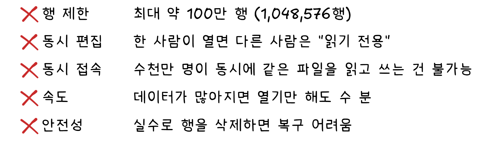
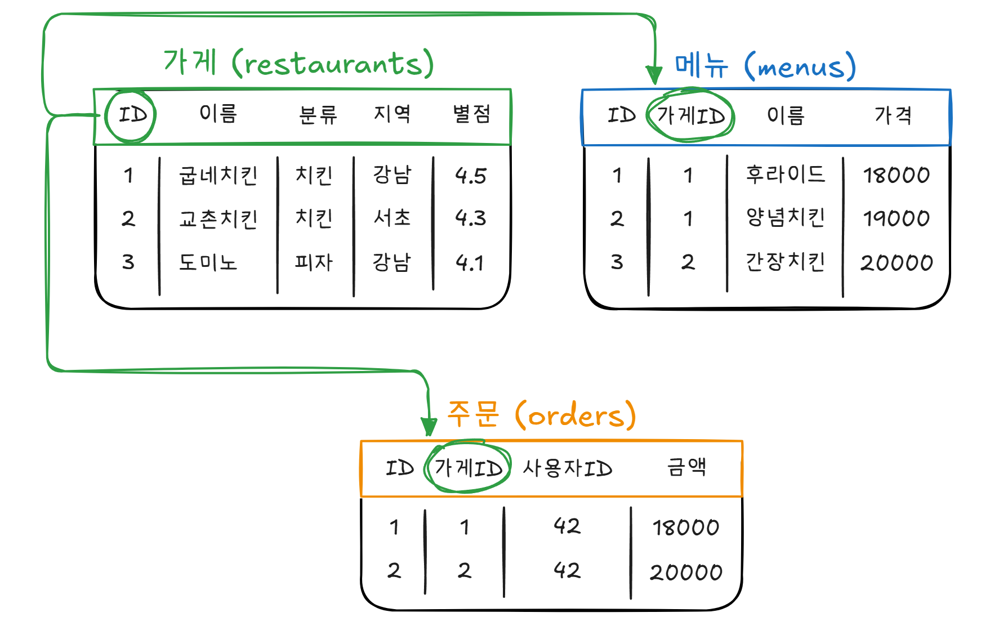
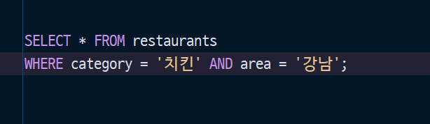
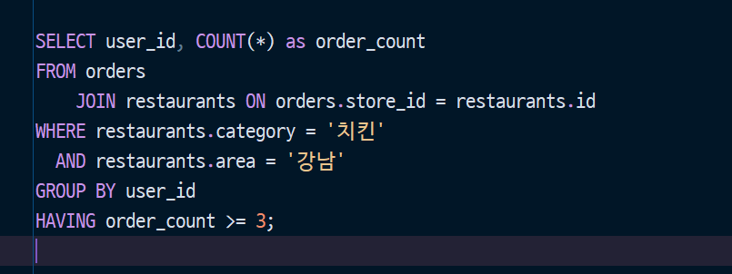
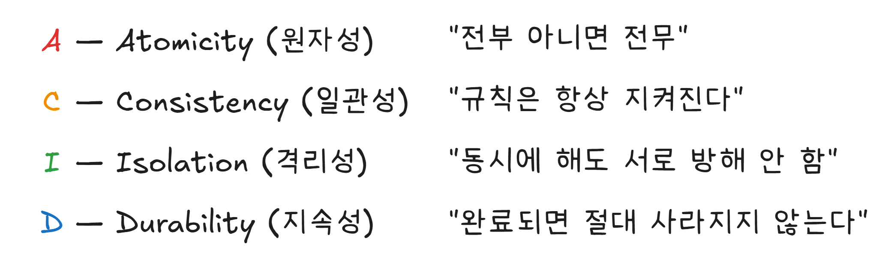
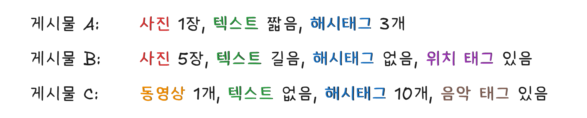
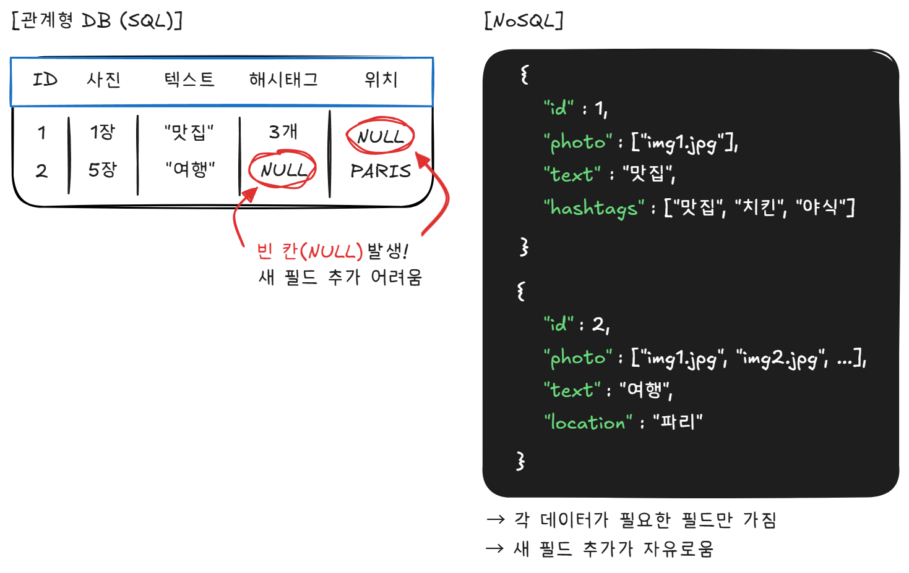
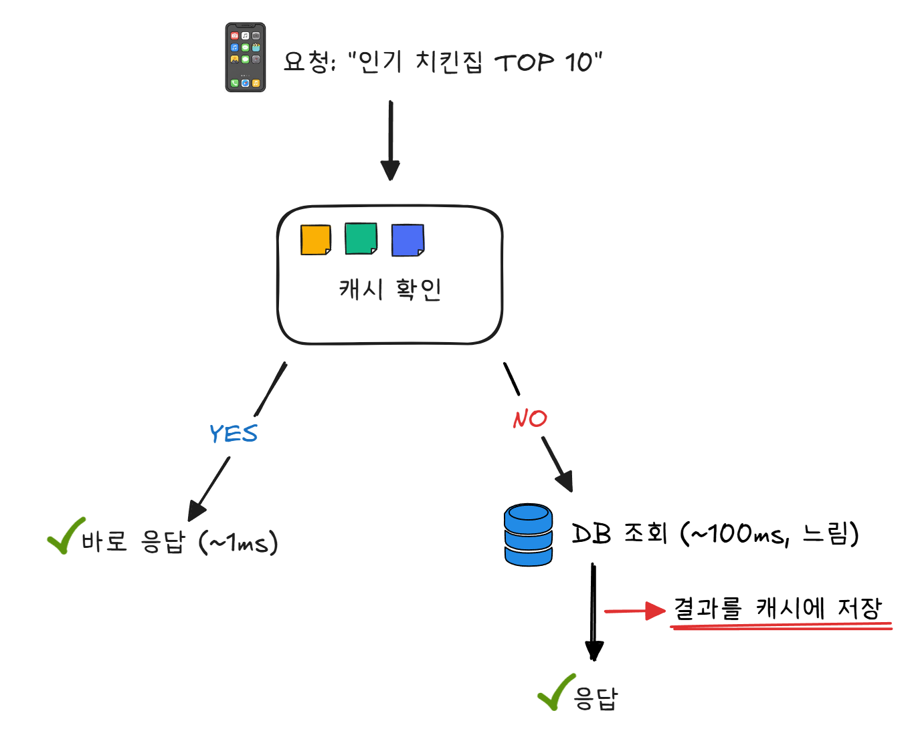
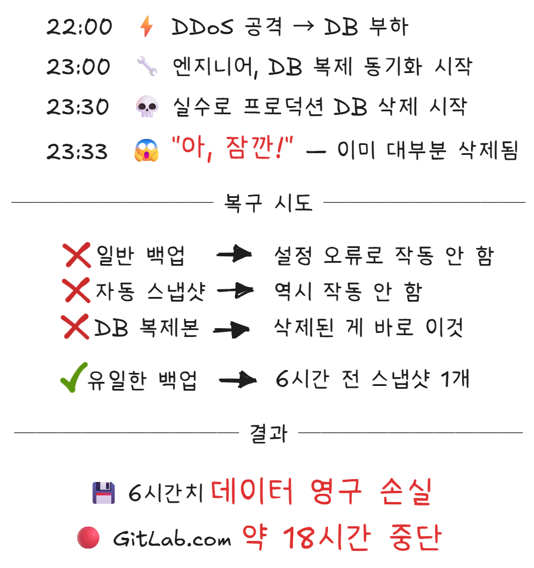

# 8장. 데이터를 담는 그릇
## "데이터베이스, SQL, NoSQL"

---

> **이번 장에서 알게 될 것**
> - 배달앱의 수십만 가게 정보가 어디에, 어떻게 저장되는지
> - "강남구에서 치킨 3번 이상 시킨 사람"을 한 줄로 찾는 방법
> - 결제할 때 "내 돈만 빠지고 가게에는 안 들어가는" 사태를 막는 원리
> - 2017년, 엔지니어 한 명의 실수로 데이터베이스가 통째로 날아간 사건

---

## 치킨 주문 여정: 검색 결과가 나왔다

> 검색 결과가 화면에 나타났습니다.
> 치킨집 목록, 메뉴 이름, 가격, 별점, 리뷰, 배달 예상 시간...
> 이 수많은 정보는 대체 어디에 저장되어 있을까요?

---

## 엑셀로는 안 되나요?

가장 먼저 떠오르는 것은 엑셀입니다. 엑셀은 데이터를 행과 열로 정리하는 도구이고, 실제로 많은 회사에서 데이터 관리에 사용합니다.

그런데 배달의민족에는 가게가 수십만 개, 메뉴는 수백만 개, 리뷰는 수억 개, 사용자는 수천만 명입니다. 이것을 엑셀로 관리할 수 있을까요?

<figure>
  
  <figcaption>[그림 8-1] 엑셀의 한계</figcaption>
</figure>

수천만 명이 동시에 같은 데이터를 읽고 쓰는 상황 — 누군가는 리뷰를 쓰고, 누군가는 주문을 넣고, 누군가는 메뉴를 검색하고 — 이것은 엑셀이 감당할 수 있는 영역이 아닙니다.

이 문제를 해결하기 위해 만들어진 것이 **데이터베이스(Database)** 입니다.

---

## 데이터베이스: 거대한 서류 캐비닛

데이터베이스를 가장 쉽게 이해하는 방법은 **서류 캐비닛**을 떠올리는 것입니다.

서류 캐비닛의 각 서랍에는 종류별로 서류가 들어 있습니다. "고객 서류" 서랍, "주문 서류" 서랍, "가게 서류" 서랍. 각 서류는 정해진 양식에 따라 작성되어 있습니다. 데이터베이스에서 이 서랍을 **테이블(Table)** 이라고 합니다.

<figure>
  
  <figcaption>[그림 8-2] 배달앱 데이터베이스 구조</figcaption>
</figure>

각 테이블은 **행(Row)** 과 **열(Column)** 로 구성됩니다. 행은 하나의 데이터(가게 1개, 메뉴 1개)이고, 열은 그 데이터의 속성(이름, 가격, 별점)입니다. 엑셀과 비슷해 보이지만, 데이터베이스는 수억 개의 행을 다루면서도 수천만 명이 동시에 접근할 수 있습니다.

테이블 사이에는 **관계(Relation)** 가 있습니다. 메뉴 테이블의 "가게ID"는 가게 테이블의 "ID"를 가리킵니다. 이렇게 테이블 간의 관계를 정의해서 데이터를 체계적으로 연결하는 데이터베이스를 **관계형 데이터베이스(Relational Database)** 라고 합니다. MySQL, PostgreSQL, Oracle이 대표적입니다.

---

## SQL: 한 줄로 질문하기

데이터베이스에 질문하는 언어가 **SQL(Structured Query Language)[^1]** 입니다. SQL은 프로그래밍 언어이지만, 영어 문장에 가까워서 읽기만 해도 대략 무슨 뜻인지 알 수 있습니다.

"강남에서 치킨집을 찾아줘"를 SQL로 쓰면 이렇습니다.

<figure>
  
  <figcaption>[그림 8-3] SQL 기본 쿼리</figcaption>
</figure>

영어로 읽어 보겠습니다. "restaurants 테이블에서(FROM) 분류가 '치킨'이고 지역이 '강남'인 것을 전부(*) 가져와라(SELECT)." 거의 영어 문장입니다.

더 복잡한 질문도 가능합니다. "강남구에서 치킨을 3번 이상 시킨 사용자를 찾아줘."

<figure>
  
  <figcaption>[그림 8-4] SQL 조건 검색 쿼리</figcaption>
</figure>

조금 복잡해 보이지만, 핵심은 같습니다. 어떤 테이블에서, 어떤 조건으로, 무엇을 가져올 것인가. 이 한 줄의 질문으로 수억 개의 데이터에서 원하는 답을 뽑아냅니다.

수억 행에서 이렇게 빠르게 찾을 수 있는 이유가 있습니다. 7장에서 역 인덱스를 설명했는데, 데이터베이스도 비슷한 원리를 사용합니다. 자주 검색하는 열(예: 지역, 분류)에 **인덱스**를 만들어 놓으면, 전체를 훑지 않고도 원하는 데이터를 빠르게 찾을 수 있습니다. 도서관의 "찾아보기"와 같은 원리입니다.

---

## ACID: "반만 처리"는 안 된다

치킨을 골랐고, 결제 버튼을 눌렀습니다. 18,000원.

이때 데이터베이스에서는 두 가지 일이 일어납니다.

<figure>
  
  <figcaption>[그림 8-5] 결제 시 데이터베이스 처리 과정</figcaption>
</figure>

만약 1번이 실행된 직후 서버가 갑자기 꺼진다면? 내 돈은 빠졌는데 치킨집에는 돈이 안 들어갑니다. 18,000원이 공중에서 사라지는 겁니다.

이런 사태를 막는 것이 **트랜잭션(Transaction)** 입니다. 트랜잭션은 "여러 작업을 하나의 묶음으로 처리"하는 것입니다. 1번과 2번 모두 성공하거나, 모두 실패하거나. 중간 상태는 없습니다.

데이터베이스가 트랜잭션을 보장하기 위해 지키는 4가지 원칙이 있습니다. 앞글자를 따서 **ACID**라고 합니다.

<figure>
  
  <figcaption>[그림 8-6] ACID 트랜잭션의 4가지 원칙</figcaption>
</figure>

**원자성(Atomicity)** 은 아까 이야기한 것입니다. 1번과 2번이 모두 성공하거나, 모두 취소되거나. 절반만 실행되는 일은 없습니다. **일관성(Consistency)** 은 "계좌 잔액이 마이너스가 되면 안 된다" 같은 규칙이 트랜잭션 전후로 항상 유지된다는 뜻입니다. **격리성(Isolation)** 은 내가 결제하는 동안 다른 사람의 결제가 내 결과를 바꾸지 않는다는 것이고, **지속성(Durability)** 은 결제가 완료된 후 서버가 꺼져도 다시 켜면 결제 기록이 남아 있다는 뜻입니다.

ACID 덕분에 온라인 결제가 가능한 겁니다. 은행 송금, 주식 거래, 항공권 예매 — 돈이 오가는 모든 시스템은 ACID를 반드시 지킵니다.

---

## NoSQL: 틀에 맞지 않는 데이터

관계형 데이터베이스는 강력하지만, 모든 데이터가 깔끔한 표에 맞지는 않습니다.

인스타그램 게시물을 떠올려 보겠습니다.

<figure>
  
  <figcaption>[그림 8-7] 인스타그램 게시물의 서로 다른 구조</figcaption>
</figure>

모든 게시물의 구조가 다릅니다. 이것을 정해진 열이 있는 테이블에 억지로 끼워 넣으면 빈 칸이 수두룩해지고, 새로운 기능(음악 태그, 스토리, 릴스)이 추가될 때마다 테이블 구조를 바꿔야 합니다.

이런 상황에서 사용하는 것이 **NoSQL(Not Only SQL)** 입니다. NoSQL은 정해진 표 형식 없이, 유연한 구조로 데이터를 저장합니다.

<figure>
  
  <figcaption>[그림 8-8] 관계형 DB와 NoSQL 비교</figcaption>
</figure>

NoSQL의 대표 주자인 **MongoDB**는 이런 유연한 구조를 제공합니다. 데이터의 형태가 다양하고, 빠르게 변화하는 서비스(SNS, 실시간 채팅, IoT[^2])에 적합합니다.

그렇다고 NoSQL이 SQL을 대체하는 것은 아닙니다. 금융 거래처럼 ACID가 필수인 곳은 관계형 DB를, 소셜 미디어처럼 유연성이 필요한 곳은 NoSQL을 씁니다. 현실의 대부분의 서비스는 둘을 함께 사용합니다.

---

## 캐시: 냉장고 앞 메모

배달앱의 메인 화면을 열면 "인기 치킨집 TOP 10" 같은 목록이 뜹니다. 수천만 명이 앱을 열 때마다 데이터베이스에서 "인기순 정렬 → 상위 10개 추출"을 매번 실행하면 어떻게 될까요? 데이터베이스가 감당이 안 됩니다.

이 문제를 해결하는 것이 **캐시(Cache)[^3]** 입니다.

냉장고 앞에 "우유 없음, 계란 3개 남음"이라고 메모를 붙여 놓았다고 해 보겠습니다. 우유가 있는지 확인하려고 매번 냉장고를 열 필요가 없습니다. 메모를 보면 됩니다. 냉장고를 여는 것(데이터베이스 조회)보다 메모를 보는 것(캐시 조회)이 훨씬 빠릅니다.

<figure>
  
  <figcaption>[그림 8-9] 캐시의 동작 원리</figcaption>
</figure>

이런 캐시 용도로 널리 쓰이는 도구가 **Redis**입니다. Redis는 데이터를 디스크가 아니라 메모리(RAM)에 저장합니다. 디스크(하드디스크, SSD)에 저장하는 데이터베이스보다 수십~수백 배 빠릅니다. 2장에서 RAM이 책상이고 저장장치가 서랍장이라고 했던 것을 기억하시나요? 책상 위에 올려놓은 것은 바로 볼 수 있지만, 서랍에서 꺼내려면 시간이 걸립니다. 같은 원리입니다.

물론 캐시의 메모(데이터)는 영원하지 않습니다. 인기 치킨집 순위는 바뀔 수 있으니까요. 일정 시간이 지나면 캐시를 지우고, 다음 요청 때 DB에서 새로 조회합니다. 이 주기를 **TTL(Time To Live)** 이라고 합니다. 냉장고 앞 메모를 매일 아침 새로 쓰는 것과 같습니다.

---

## 사건: 2017 GitLab 데이터베이스 삭제 — 6시간이 사라진 밤

2017년 1월 31일, 개발자 협업 플랫폼 **GitLab**에서 대규모 장애가 발생합니다.[^4]

원인은 황당할 정도로 단순했습니다. 야간 유지보수 중이던 엔지니어가, **프로덕션[^5] 데이터베이스를 실수로 삭제**한 것입니다.

<figure>
  
  <figcaption>[그림 8-10] GitLab 데이터베이스 삭제 사건 경위</figcaption>
</figure>

GitLab은 이 사건을 투명하게 공개했습니다. 실시간 복구 과정을 유튜브로 생중계하고, 사건 보고서를 전문 공개했습니다. 5개의 백업 방식이 모두 제대로 작동하지 않고 있었다는 충격적인 사실도 밝혔습니다.

이 사건의 교훈은 명확합니다. **백업은 "하고 있다"가 아니라 "복구할 수 있다"가 중요합니다.** 백업 시스템이 돌아가고 있어도, 실제로 복구를 테스트해보지 않으면 그것이 진짜 작동하는지 알 수 없습니다.

---

## 알쓸신잡

- **SQL 읽어보기**: `SELECT name, price FROM menus WHERE store_id = 1 ORDER BY price DESC;` — "menus 테이블에서(FROM) 가게ID가 1인(WHERE) 메뉴의 이름과 가격을 가져와서(SELECT) 가격 내림차순으로 정렬해라(ORDER BY ... DESC)." SQL이 영어 문장과 비슷하다는 것을 알 수 있습니다. 1970년대에 "비전문가도 데이터에 질문할 수 있어야 한다"는 철학으로 설계되었기 때문입니다.

- **넷플릭스의 데이터**: 넷플릭스의 영상 마스터 카탈로그만 약 **3페타바이트(PB)** 에 달하며, 사용자 데이터까지 합치면 수백 PB 규모입니다. 영상 콘텐츠뿐 아니라, 사용자가 어디서 일시정지했는지, 어느 장면에서 되감기했는지, 검색 기록, 시청 패턴까지 전부 저장합니다. 이 데이터가 12장에서 이야기할 추천 알고리즘의 연료가 됩니다.

- **DELETE와 DROP의 차이**: 데이터베이스에서 `DELETE`는 테이블 안의 데이터(행)를 지우는 것이고, `DROP`은 테이블 자체를 없애는 것입니다. 서류 캐비닛에서 서류를 꺼내 버리는 것(DELETE)과, 서랍 자체를 뜯어내는 것(DROP)의 차이입니다. 신입 개발자가 프로덕션에서 `DROP TABLE`을 실행하는 순간을 상상하면 — 이것이 GitLab 사건이 남의 일이 아닌 이유입니다.

치킨을 골랐습니다. 장바구니에 담았습니다. 이제 결제 버튼을 누릅니다. 카드 번호가 인터넷을 타고 전송됩니다. 그런데 잠깐 — 아까 6장에서 카페 WiFi가 위험하다고 했습니다. 내 카드 번호를 누군가 중간에서 엿보면 어떻게 하죠? 안전한 건가요?

---

[^1]: SQL(Structured Query Language): 구조화 질의 언어. 데이터베이스에 질문(query)하거나 데이터를 추가/수정/삭제하는 데 쓰는 표준 언어. 1970년대 IBM에서 처음 개발되었다.
[^2]: IoT(Internet of Things): 사물 인터넷. 냉장고, 에어컨, 스피커 같은 일상 기기가 인터넷에 연결되어 데이터를 주고받는 것.
[^3]: 캐시(Cache): 자주 사용하는 데이터를 임시로 저장해 두는 고속 저장소. 웹 브라우저의 캐시(방문한 페이지를 저장), CPU 캐시(자주 쓰는 데이터를 메모리보다 빠른 곳에 저장) 등 컴퓨터 곳곳에서 같은 원리가 사용된다.
[^4]: 2017년 1월 31일. 약 18시간 중단, 6시간치 데이터 손실. — [GitLab Postmortem](https://about.gitlab.com/blog/postmortem-of-database-outage-of-january-31/)
[^5]: 프로덕션(Production): 실제 사용자가 이용하는 운영 환경. 개발자가 테스트하는 환경(개발/스테이징)과 구분된다. 프로덕션에서의 실수는 곧바로 실제 사용자에게 영향을 미친다.
