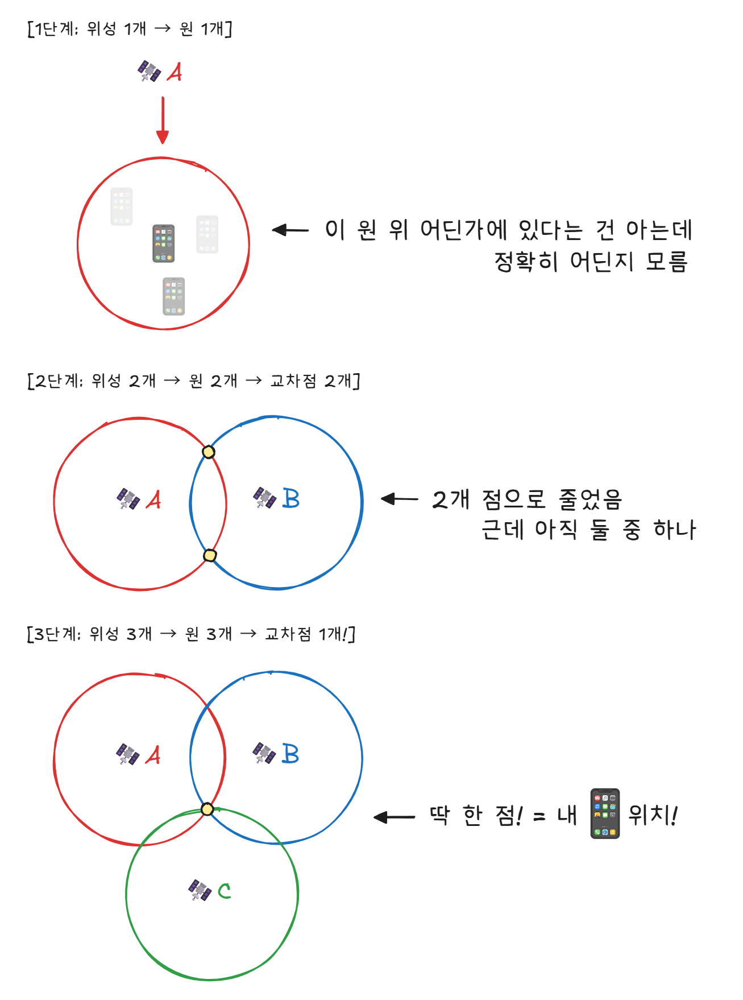
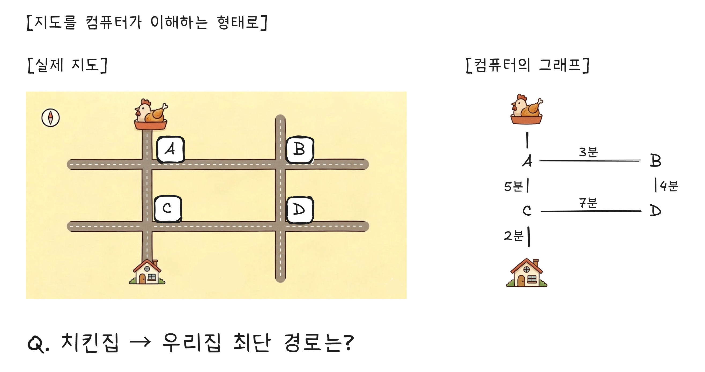
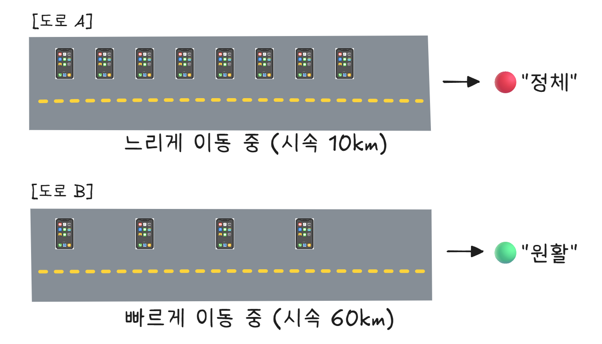
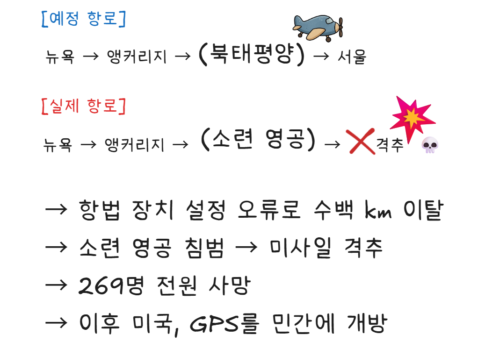

# 11장. 지도 앱은 어떻게 길을 찾는가
## "GPS, 지도, 경로 탐색 알고리즘"

---

> **이번 장에서 알게 될 것**
> - 스마트폰이 내 위치를 수 미터 오차로 아는 원리
> - 아인슈타인의 상대성이론이 GPS에 적용되고 있다는 사실
> - 지도 앱이 가장 빠른 길을 찾는 알고리즘
> - 배달 예상 시간 "35분"이 어떻게 계산되는지

---

## 치킨 주문 여정: 치킨이 출발했다

> "주문이 접수되었습니다."
> "배달원이 가게에서 출발했습니다."
> 화면에 지도가 뜨고, 배달원의 위치가 실시간으로 움직입니다.
> 배달원의 위치를 어떻게 아는 걸까요?

---

## 하늘 위 20,200km에서 쏘는 시간 신호

배달원의 위치를 아는 것, 즉 **GPS(Global Positioning System)** 의 원리부터 알아보겠습니다.

지구 궤도 약 20,200km 높이에는 **31개**의 GPS 위성이 돌고 있습니다. 이 위성들은 끊임없이 하나의 메시지를 보냅니다 — **"나는 지금 여기에 있고, 지금 시각은 이것이다."**

스마트폰은 이 신호를 받아서 자신의 위치를 계산합니다. 원리는 이렇습니다. 각 위성이 "내 위치는 여기, 시각은 12시 정각"이라고 보냈는데 스마트폰에 0.067초 뒤에 도착했다면, 전파 속도(빛의 속도)에 시간을 곱해 그 위성으로부터의 거리를 알 수 있습니다.

위성 하나로는 "위성에서 20,100km 떨어진 구(球) 위의 어딘가"까지만 알 수 있습니다. 위성 두 개면 두 구의 교차선, 세 개면 두 점, 네 개면 정확한 한 점이 됩니다. 이것을 **삼변측량[^1]** 이라고 합니다.

<figure>
  
  <figcaption>[그림 11-1] 삼변측량의 원리</figcaption>
</figure>

실제로는 위성 **최소 4개**가 필요합니다. 3개로 위치를 정하고, 4번째로 시간 오차를 보정합니다.

### 1나노초 = 30cm 오차

GPS에서 시간은 생명입니다. 전파는 빛의 속도(초속 약 30만 km)로 이동합니다. 1초에 30만 km를 가니까, **10억분의 1초(1나노초)** 의 시간 오차는 **약 30cm**의 거리 오차가 됩니다.

이 정밀한 시간을 측정하기 위해 GPS 위성에는 **원자시계**가 탑재되어 있습니다. 원자시계는 10만 년에 1초 정도의 오차만 발생하는, 인류가 만든 가장 정확한 시계입니다.

### 아인슈타인이 GPS를 가능하게 했다

GPS 위성은 초속 약 3.9km로 움직이고, 지상 20,200km 높이에 있습니다. 여기서 아인슈타인의 상대성이론이 등장합니다.

| 효과 | 방향 | 크기 |
|------|------|------|
| 특수 상대성이론 | 느려짐 | -7μs/일 |
| 일반 상대성이론 | 빨라짐 | +45μs/일 |

합산 = **+38μs/일** (하루에 38마이크로초 빨라짐)

위성의 시계가 하루에 38마이크로초씩 빨라지는 것을 보정하지 않으면, GPS 위치가 하루에 약 **11km**씩 틀어집니다. 내비게이션이 한강을 가리키고 있을 수 있다는 뜻입니다. 100년 전 이론물리학자가 쓴 공식이 오늘날 배달 추적에 사용되고 있는 셈입니다.

---

## 최단 경로: 네비게이션은 어떻게 길을 찾는가

배달원의 위치를 알았으니, 이제 가게에서 우리 집까지의 **최적 경로**를 찾아야 합니다.

지도를 컴퓨터가 이해할 수 있는 형태로 바꾸면, 교차로는 **점(노드)**, 도로는 **선(간선)**, 도로의 거리나 시간은 **가중치**가 됩니다.

<figure>
  
  <figcaption>[그림 11-2] 지도에서 그래프로의 변환</figcaption>
</figure>

이 그래프[^2]에서 최단 경로를 푸는 가장 유명한 알고리즘이 **다익스트라(Dijkstra) 알고리즘**입니다. 1956년 네덜란드 컴퓨터 과학자 에츠허르 다익스트라가 카페에서 종이 위에 20분 만에 고안했다고 합니다.

다익스트라 알고리즘의 아이디어는 간단합니다. "가장 가까운 곳부터 확정하고, 점점 넓혀간다"는 것입니다.

1. 출발점(치킨집)에서 시작합니다.
2. 바로 갈 수 있는 곳 중 가장 가까운 곳을 "확정"합니다.
3. 확정된 곳에서 갈 수 있는 새로운 곳의 거리를 계산합니다.
4. 아직 확정 안 된 곳 중 가장 가까운 곳을 다시 "확정"합니다.
5. 목적지가 확정될 때까지 반복합니다.

마치 물이 퍼져나가듯, 출발점에서 가장 가까운 곳부터 차례로 확정하는 방식입니다.

구글 맵, 카카오맵, 네이버 지도 모두 이 알고리즘의 변형을 사용합니다. 물론 실제로는 도로의 수가 수백만 개이므로, 더 빠르게 계산하기 위한 다양한 최적화 기법이 추가됩니다.

---

## 실시간 교통: 지금 이 도로가 막히는지 어떻게 아는가

최단 거리가 항상 최단 시간은 아닙니다. 가장 짧은 도로가 교통 체증으로 막혀 있다면, 돌아가는 게 더 빠를 수 있습니다.

지도 앱은 실시간 교통 정보를 어디서 얻을까요? 답은 **여러분의 폰**입니다.

<figure>
  
  <figcaption>[그림 11-3] 실시간 교통 정보 수집</figcaption>
</figure>

구글 맵은 안드로이드 폰의 위치 데이터를 (익명으로) 수집합니다. 카카오맵은 카카오 택시와 카카오 내비 사용자의 GPS 데이터를 활용합니다. 특정 도로에서 여러 대의 폰이 느리게 이동하면 "정체", 빠르게 이동하면 "원활"로 판단합니다.

이것을 **크라우드소싱(Crowdsourcing)[^3]** 이라고 합니다. 지도 앱을 사용하는 사람이 많을수록 교통 정보가 정확해집니다. 여러분이 내비게이션을 켜고 운전하는 것만으로도, 다른 사람의 내비게이션에 기여하고 있는 겁니다.

---

## 배달 예상 시간: "35분"은 어떻게 계산되나

"배달 예상 시간: 35분." 이 숫자는 어떻게 나올까요? 단순히 "거리 ÷ 속도"로 계산하는 것이 아닙니다. 가게의 현재 주문량, 실시간 교통, 날씨, 요일, 시간대, 과거 배달 데이터까지 종합합니다. 이 모든 변수를 인간이 직접 계산하는 것은 불가능하므로, **머신러닝(Machine Learning)[^4]** 모델이 과거 수백만 건의 배달 데이터를 학습해서 예측합니다.

그래서 배달 예상 시간은 때로 정확하고, 때로 틀립니다. 예측 모델이 경험하지 못한 상황(갑작스러운 폭우, 사고로 인한 도로 차단)이 발생하면 오차가 커집니다.

---

## 사건: 대한항공 007편 — GPS가 민간에 개방된 계기

1983년 9월 1일, 뉴욕발 서울행 **대한항공 007편**이 소련 영공을 침범해 격추됩니다.[^5] 탑승자 269명 전원이 사망했습니다.

사고 원인은 항법 장치의 설정 오류였습니다. 항로에서 수백 킬로미터 벗어나 소련 영공으로 진입한 것입니다. 소련은 이를 스파이 비행기로 판단하고 미사일을 발사했습니다.

<figure>
  
  <figcaption>[그림 11-4] 대한항공 007편 항로 비교</figcaption>
</figure>

이 사건 이후, 미국의 레이건 대통령은 군사용으로만 사용되던 **GPS를 민간에 개방**하겠다고 발표합니다.[^6] 이런 비극이 다시 일어나지 않도록, 전 세계 민간 항공기가 정확한 위치를 알 수 있게 하겠다는 결정이었습니다.

다만 민간용 GPS에는 의도적으로 오차를 넣었습니다(**SA: Selective Availability**). 군사적 이유로 민간용 GPS의 정확도를 100m 수준으로 제한한 것입니다. 이 제한은 2000년 클린턴 대통령이 해제하면서, GPS 정확도가 약 **10m 이내**로 향상됩니다. 현재 스마트폰의 GPS가 이 정도 정확도를 가지는 이유입니다. 여기에 스마트폰은 GPS만 쓰는 것이 아니라 WiFi 신호, 기지국 위치, 가속도 센서까지 조합해서 위치를 보정합니다. 실내에서 GPS 신호가 약해져도 주변 WiFi 공유기의 위치 정보로 대략적 위치를 파악할 수 있는 것은 이 때문입니다.

---

## 알쓸신잡

- **GPS는 미국 것이다**: GPS는 미국 국방부가 운영하는 시스템입니다. 미국이 마음먹으면 특정 지역의 GPS 신호를 의도적으로 교란하거나 끌 수 있습니다. 그래서 다른 나라들도 자체 위성 항법 시스템을 운영합니다. 러시아의 **GLONASS**, 유럽의 **Galileo**, 중국의 **BeiDou(북두)**, 일본의 **QZSS**. 스마트폰은 보통 이 중 여러 개를 동시에 사용해서 정확도를 높입니다.

- **포켓몬 GO와 GPS 스푸핑**: 2016년 포켓몬 GO가 출시되자, 집에서 편하게 포켓몬을 잡기 위해 **GPS 스푸핑(Spoofing)** — 가짜 GPS 신호를 보내서 위치를 속이는 것 — 이 유행합니다. 하지만 GPS 스푸핑은 게임에서만 쓰이는 것이 아닙니다. 2017년 흑해에서 약 20척의 선박이 동시에 GPS 위치가 내륙으로 표시되는 사건이 발생했는데, 러시아의 GPS 교란 실험으로 추정됩니다. 군사적 GPS 교란은 실제로 일어나고 있는 현실입니다.

- **스마트폰 99대로 가짜 교통 체증 만들기**: 2020년, 베를린의 아티스트 Simon Weckert가 스마트폰 99대를 빨간 손수레에 싣고 텅 빈 거리를 걸어다녔습니다. 구글 맵은 이 도로를 극심한 정체로 표시했고, 실제 운전자들이 우회하기 시작했습니다. 차 한 대 없는 거리에 "가짜 교통 체증"이 만들어진 겁니다. 구글은 "자동차든, 손수레든, 낙타든, 구글 맵의 창의적인 활용을 환영합니다"라고 답했습니다.[^7] 이 실험은 크라우드소싱 데이터를 우리가 얼마나 맹신하는지를 보여주는 사례입니다.

치킨이 오고 있습니다. 지도에서 배달원의 파란 점이 점점 가까워집니다. 그런데 다음에 배달앱을 열면, 앱이 "이 치킨집 어떠세요?"라고 추천할 겁니다. 내가 치킨을 좋아한다는 걸 어떻게 아는 걸까요? 내 취향을 어떻게 파악하는 걸까요?

---

[^1]: 삼변측량(Trilateration): 3개 이상의 기준점으로부터의 거리를 이용해 위치를 결정하는 방법. "삼각측량(Triangulation)"은 각도를 이용하는 것이고, GPS는 거리를 이용하므로 삼변측량이 정확한 표현이다.
[^2]: 그래프(Graph): 점(노드)과 선(간선)으로 이루어진 자료구조. 지도, 소셜 네트워크(친구 관계), 인터넷(라우터 연결) 등 "연결 관계"를 표현하는 데 사용된다.
[^3]: 크라우드소싱(Crowdsourcing): 대중(Crowd)에게서 정보나 서비스를 얻는(Sourcing) 것. 위키피디아(대중이 만드는 백과사전), 교통 정보(운전자가 만드는 교통 데이터) 등이 대표적.
[^4]: 머신러닝(Machine Learning): 기계 학습. 컴퓨터가 데이터에서 패턴을 스스로 학습하여 예측하는 기술. 명시적으로 프로그래밍하지 않아도, 데이터를 많이 줄수록 예측이 정확해진다.
[^5]: 1983년 9월 1일, 탑승자 269명 전원 사망. — [Smithsonian National Air and Space Museum](https://timeandnavigation.si.edu/satellite-navigation/challenges-of-satellite-navigation/soviets-shoot-down-an-airliner)
[^6]: 사건 2주 후 발표. — [Reagan Presidential Library](https://www.reaganlibrary.gov/archives/speech/address-nation-soviet-attack-korean-civilian-airliner)
[^7]: Simon Weckert, "Google Maps Hacks" (2020). 구글 대변인 공식 답변. — [Android Authority](https://www.androidauthority.com/google-maps-hack-1079604/)
